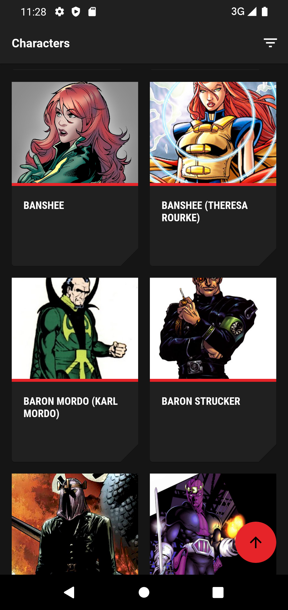
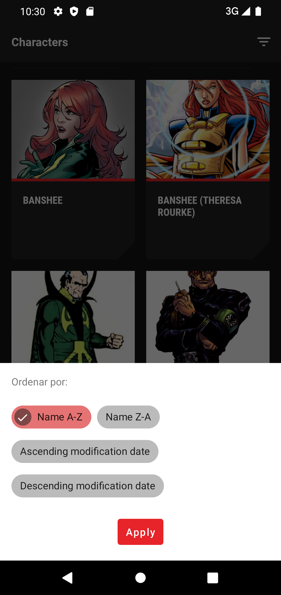
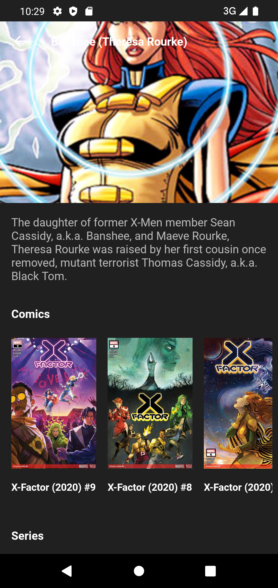
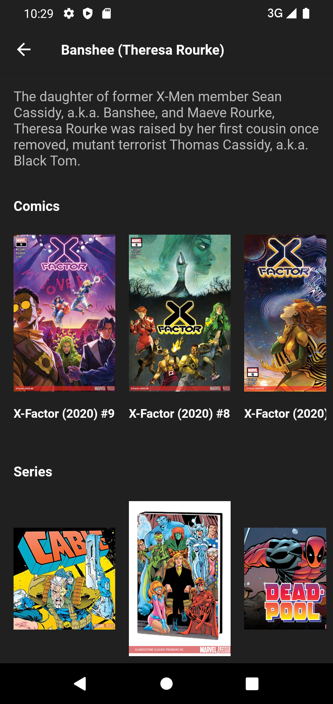
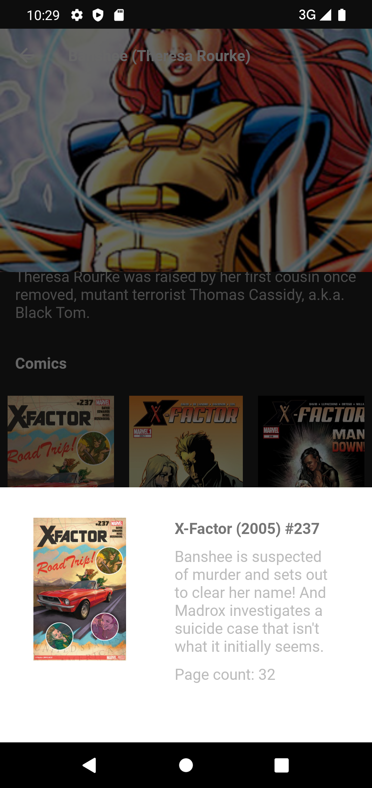
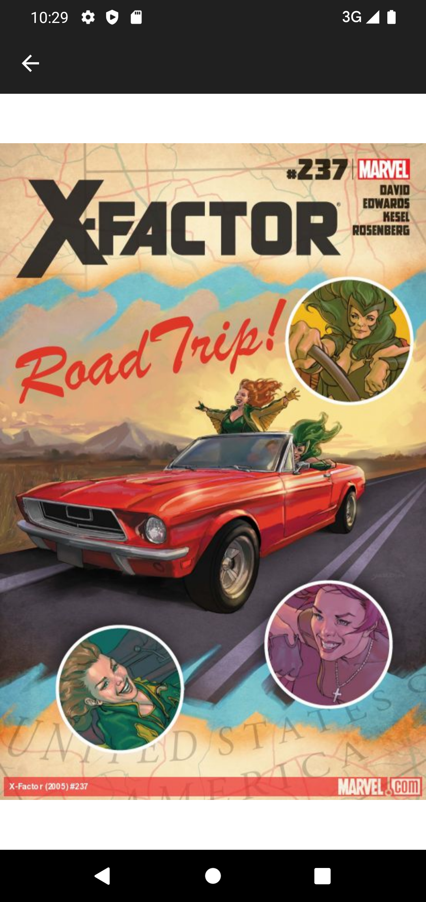

# Marvel Characters App

Shows the list of Marvel characters, from [Marvel API](https://developer.marvel.com/).

## Implemented frameworks.
- [Dagger Hilt](https://dagger.dev/hilt/) - Dependency injection.
- [Retrofit](https://square.github.io/retrofit/) + [OkHttp](https://square.github.io/okhttp/) - Http calls.
- [Glide](https://github.com/bumptech/glide) - Image proccessor.
- [Paging 3](https://developer.android.com/topic/libraries/architecture/paging/v3-overview) - Load items into lists with paging.
- [Lottie](http://airbnb.io/lottie/#/android) - Animation processor
- [Shimmer](http://facebook.github.io/shimmer-android/) - Animation loading view.

## Explanation

This app gets the character list from the Marvel API.
  

* List screen

In the list screen (home screen), there is a paginated list that is consulting as you scroll.
The default order is by name ascending (`name`), and you can change the order.

Orders available:

1. Name ascending: `name`
2. Name descending: `-name`
3. Modified date ascending: `modified`
4. Modified date descending: `-modified `
 

* Character details screen

In the details screen, it shows the name, image, description, comics and series. The list of comics and series will only be visible when in the character's API response, it indicates that the available number of comics or series is greater than zero.
  
* Comic or serie detail dialog

In the dialog, the thumbnail image, title, description, ISBN and number of pages (if it is comic), and rating (if it is series) are shown.
  
* Image detail screen

This screen shows the image you want to see, that of the characters, the comic or the series.

 

| Screenshot  | Description  |
|:----------|:----------|
|  | Characters list. Incorporates a FAB to scroll in list.|
|  | Dialog with different options to sort the list.      |
|  | Character details. Shows the character's comics and series.
|  | Comics and series list.
|  | Detail from the comic or series. 
|  | Image details.

## Future improvements
- Add more android test and unit test, adding fake repositories, etc...
- Implements searchview in list screen to search characters by name.
- Implements Jetpack Compose.